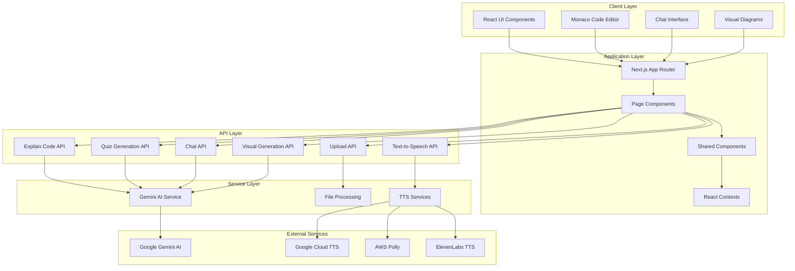

# AI Code Mentor - Architecture Documentation

## 🏗️ System Overview

AI Code Mentor is a modern web application built with Next.js that provides intelligent code analysis and learning features. The system follows a client-server architecture with AI integration for code understanding and explanation.

## 🎯 Core Architecture Principles

- **Component-Based Design**: Modular React components for reusability
- **API-First Approach**: RESTful API design for clear separation of concerns
- **AI-Driven Intelligence**: Google Gemini AI integration for code analysis
- **Real-time Processing**: Efficient file processing and analysis
- **Responsive Design**: Mobile-first, accessible user interface

## 🔧 Technology Stack

### Frontend
- **Framework**: Next.js 15 with App Router
- **Language**: TypeScript for type safety
- **UI Library**: React 19 with modern hooks
- **Styling**: Tailwind CSS 4 for utility-first styling
- **Code Editor**: Monaco Editor for syntax highlighting
- **State Management**: React Context API
- **Icons**: Lucide React, React Icons

### Backend
- **Runtime**: Node.js with Next.js API routes
- **File Processing**: JSZip for ZIP extraction, Simple Git for repository cloning
- **AI Integration**: Google Gemini AI for code analysis
- **Text-to-Speech**: Google Cloud TTS, AWS Polly, ElevenLabs

### Development Tools
- **Package Manager**: npm/yarn/pnpm
- **Linting**: ESLint with Next.js configuration
- **Type Checking**: TypeScript compiler
- **Build Tool**: Next.js built-in bundler

## 📊 System Architecture Diagram



## 🔄 Data Flow Architecture

### 1. Project Upload Flow
```
User Upload → Upload API → File Processing → Project Storage → File Tree Generation → Dashboard
```

### 2. Code Explanation Flow
```
Code Selection → Explain API → Gemini AI → Explanation Generation → UI Display
```

### 3. Visual Diagram Flow
```
Code Selection → Visual API → Gemini AI → Flow Data → ReactFlow Rendering
```

### 4. Chat Interaction Flow
```
User Message → Chat API → Gemini AI → Response Generation → Chat Interface
```

## 📁 Directory Structure

```
ai-code-mentor/
├── src/
│   ├── app/                    # Next.js App Router
│   │   ├── api/               # API route handlers
│   │   │   ├── chat/          # Chat functionality
│   │   │   ├── explain-code/  # Code explanation
│   │   │   ├── generate-quiz/ # Quiz generation
│   │   │   ├── generate-visual/ # Visual diagrams
│   │   │   ├── project-files/ # File management
│   │   │   ├── upload-project/ # Project upload
│   │   │   └── text-to-speech/ # Voice narration
│   │   ├── dashboard/         # Main application pages
│   │   ├── project-summary/   # Project overview pages
│   │   ├── about/            # About page
│   │   ├── globals.css       # Global styles
│   │   ├── layout.tsx        # Root layout
│   │   └── page.tsx          # Home page
│   ├── components/            # Reusable React components
│   │   ├── ChatInterface.tsx  # AI chat component
│   │   ├── CodeEditor.tsx     # Monaco editor wrapper
│   │   ├── FileExplorer.tsx   # File browser
│   │   ├── Header.tsx         # Navigation header
│   │   ├── ProjectUpload.tsx  # Upload interface
│   │   ├── ProjectSummary.tsx # Project overview
│   │   ├── SettingsModal.tsx  # User preferences
│   │   └── VisualExplanation.tsx # Flow diagrams
│   ├── contexts/             # React context providers
│   │   └── SettingsContext.tsx # User settings
│   ├── hooks/                # Custom React hooks
│   │   └── useCodeHighlight.ts # Code highlighting
│   ├── types/                # TypeScript definitions
│   │   └── speech-recognition.d.ts
│   ├── utils/                # Utility functions
│   │   ├── beginnerLensFilters.ts # File filtering
│   │   ├── gemini.ts         # AI integration
│   │   ├── translation.ts    # Language support
│   │   └── tts.ts           # Text-to-speech
│   └── config/              # Configuration files
│       └── api.ts           # API configuration
├── public/                  # Static assets
├── projects/               # Uploaded project storage
├── docs/                   # Documentation
├── package.json           # Dependencies
├── next.config.ts         # Next.js configuration
├── tailwind.config.js     # Tailwind configuration
└── tsconfig.json         # TypeScript configuration
```

## 🔌 Component Architecture

### Core Components

#### 1. **CodeEditor Component**
- **Purpose**: Main code viewing and interaction interface
- **Features**: Syntax highlighting, code selection, explanation panels
- **Dependencies**: Monaco Editor, AI explanation services
- **State**: Selected code, explanations, visual diagrams

#### 2. **FileExplorer Component**
- **Purpose**: Project file navigation and filtering
- **Features**: Tree view, beginner lens filtering, file selection
- **Dependencies**: File system API
- **State**: File tree, selected file, filter settings

#### 3. **ChatInterface Component**
- **Purpose**: AI-powered chat for code questions
- **Features**: Message history, voice input, quiz generation
- **Dependencies**: Chat API, speech recognition
- **State**: Messages, loading states, quiz data

#### 4. **VisualExplanation Component**
- **Purpose**: Interactive flow diagrams for code visualization
- **Features**: ReactFlow integration, dynamic diagram generation
- **Dependencies**: ReactFlow, Visual generation API
- **State**: Nodes, edges, diagram metadata

### Shared Components

#### 1. **Header Component**
- **Purpose**: Navigation and project context
- **Features**: Project info, settings access, navigation
- **State**: Project metadata, user preferences

#### 2. **ProjectUpload Component**
- **Purpose**: Project upload interface
- **Features**: Drag-and-drop, Git cloning, progress tracking
- **Dependencies**: Upload API, file validation
- **State**: Upload progress, error handling

## 🔄 State Management

### Context Providers
- **SettingsContext**: User preferences, language settings, voice options
- **ProjectContext**: Current project data, file structure
- **ThemeContext**: UI theme and appearance settings

### Component State
- Local state for UI interactions
- Shared state through context providers
- API state management with loading/error states

## 🚀 Performance Considerations

### Optimization Strategies
- **Code Splitting**: Dynamic imports for large components
- **Lazy Loading**: On-demand component loading
- **Memoization**: React.memo for expensive components
- **Caching**: API response caching for repeated requests
- **File Processing**: Streaming for large file uploads

### Scalability Features
- **Modular Architecture**: Easy to extend with new features
- **API Abstraction**: Clean separation between frontend and backend
- **Component Reusability**: Shared components across pages
- **Type Safety**: TypeScript for maintainable code

## 🔒 Security Architecture

### Data Protection
- **Input Validation**: Server-side validation for all inputs
- **Path Traversal Protection**: Secure file access patterns
- **API Rate Limiting**: Protection against abuse
- **Environment Variables**: Secure credential management

### Privacy Considerations
- **Local Processing**: Code analysis without permanent storage
- **Temporary Storage**: Project files cleaned up after sessions
- **No Code Persistence**: User code not permanently stored
- **Secure API Keys**: Environment-based configuration
