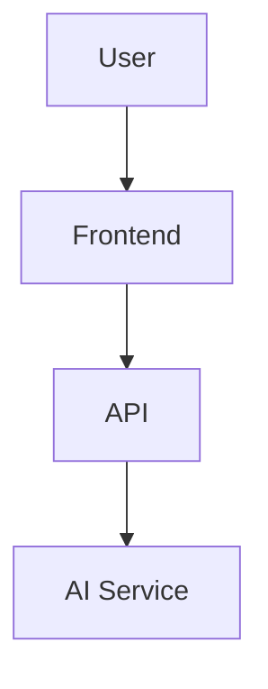

# AI Code Mentor - Documentation

## 📚 Documentation Overview

Welcome to the comprehensive documentation for AI Code Mentor! This documentation provides everything you need to understand, use, deploy, and contribute to the AI Code Mentor platform.

## 📖 Documentation Structure

### 🚀 [Getting Started](../README.md)
The main README file contains:
- Project overview and features
- Quick start guide
- Installation instructions
- Basic usage examples

### 🏗️ [Architecture Documentation](ARCHITECTURE.md)
Detailed technical architecture including:
- System overview and design principles
- Technology stack and dependencies
- Component architecture and data flow
- Directory structure and organization
- Performance and security considerations

### 🔌 [API Documentation](API.md)
Complete API reference covering:
- All available endpoints
- Request/response formats
- Authentication requirements
- Usage examples and error handling
- Rate limiting and best practices

### 🧩 [Component Documentation](COMPONENTS.md)
Frontend component reference including:
- Component hierarchy and relationships
- Props interfaces and usage patterns
- State management approaches
- Styling conventions and examples
- Testing strategies and examples

### 🚀 [Deployment Guide](DEPLOYMENT.md)
Comprehensive deployment instructions for:
- Local development setup
- Production deployment options (Vercel, Netlify, Docker, Self-hosted)
- Environment configuration
- Security considerations
- Monitoring and maintenance

### 👤 [User Guide](USER_GUIDE.md)
End-user documentation covering:
- How to upload and explore projects
- Using the code editor and AI features
- Chat interface and quiz functionality
- Settings and preferences
- Tips for effective learning

### 👨‍💻 [Developer Guide](DEVELOPER_GUIDE.md)
Technical guide for contributors including:
- Development environment setup
- Architecture patterns and conventions
- API development guidelines
- Frontend development best practices
- Testing and debugging approaches

### 🤝 [Contributing Guide](CONTRIBUTING.md)
Guidelines for contributors covering:
- How to contribute (code, docs, issues)
- Development workflow and standards
- Pull request process
- Code style and testing requirements
- Community guidelines

### ❓ [FAQ](FAQ.md)
Frequently asked questions about:
- General platform questions
- Technical setup and troubleshooting
- Usage tips and best practices
- Privacy and security concerns
- Future features and roadmap

## 🎯 Quick Navigation

### For Users
- **New to the platform?** Start with the [User Guide](USER_GUIDE.md)
- **Having issues?** Check the [FAQ](FAQ.md)
- **Want to learn more?** Read the main [README](../README.md)

### For Developers
- **Want to contribute?** Read the [Contributing Guide](CONTRIBUTING.md)
- **Setting up locally?** Follow the [Developer Guide](DEVELOPER_GUIDE.md)
- **Understanding the codebase?** Check the [Architecture Documentation](ARCHITECTURE.md)
- **Working with APIs?** Reference the [API Documentation](API.md)
- **Building components?** See the [Component Documentation](COMPONENTS.md)

### For DevOps/Deployment
- **Deploying the app?** Follow the [Deployment Guide](DEPLOYMENT.md)
- **Understanding architecture?** Review [Architecture Documentation](ARCHITECTURE.md)
- **API integration?** Check [API Documentation](API.md)

## 🔄 Documentation Updates

### Keeping Documentation Current
This documentation is maintained alongside the codebase. When contributing:

1. **Update relevant docs** when making code changes
2. **Add new sections** for new features
3. **Fix outdated information** when you find it
4. **Improve clarity** and add examples where helpful

### Documentation Standards
- **Clear and concise** writing
- **Code examples** for technical content
- **Screenshots** for UI-related documentation
- **Consistent formatting** using Markdown
- **Up-to-date** information that matches the current codebase

## 🛠️ Documentation Tools

### Markdown Features
This documentation uses standard Markdown with some enhancements:
- **Code syntax highlighting** for multiple languages
- **Mermaid diagrams** for architecture visualization
- **Tables** for structured information
- **Callout boxes** for important notes

### Diagram Generation
Architecture diagrams are created using Mermaid:


### Code Examples
Code examples include syntax highlighting:
```typescript
interface ComponentProps {
  data: DataType;
  onAction: (item: DataType) => void;
}

export const MyComponent = ({ data, onAction }: ComponentProps) => {
  return <div onClick={() => onAction(data)}>{data.name}</div>;
};
```

## 📝 Contributing to Documentation

### How to Contribute
1. **Identify gaps** or outdated information
2. **Create an issue** describing the documentation need
3. **Submit a pull request** with improvements
4. **Review process** ensures quality and accuracy

### Documentation Types Needed
- **Tutorial content** for complex features
- **Troubleshooting guides** for common issues
- **Best practices** and usage patterns
- **Integration examples** with other tools
- **Video tutorials** and visual guides

### Writing Guidelines
- **Audience-focused**: Write for your intended reader
- **Step-by-step**: Break complex processes into steps
- **Examples**: Include practical, working examples
- **Screenshots**: Add visuals for UI-related content
- **Testing**: Verify all instructions work as written

## 🔍 Finding Information

### Search Tips
- Use your browser's search (Ctrl/Cmd + F) within documents
- Check the FAQ for common questions
- Look at code examples in the Developer Guide
- Review API documentation for technical details

### Cross-References
Documentation includes links between related sections:
- Architecture → API → Components
- User Guide → FAQ → Troubleshooting
- Developer Guide → Contributing → Architecture

## 📞 Getting Help

### Documentation Issues
If you find problems with the documentation:
- **Create an issue** on GitHub
- **Suggest improvements** via pull request
- **Ask questions** in community channels
- **Provide feedback** on clarity and completeness

### Community Resources
- **GitHub Discussions**: Ask questions and share ideas
- **Discord Community**: Real-time help and discussion
- **Email Support**: Direct contact for complex issues
- **Video Tutorials**: Visual learning resources

## 🎉 Acknowledgments

This documentation is maintained by the AI Code Mentor community. Special thanks to all contributors who help keep it accurate, comprehensive, and useful.

### Contributors
- Core development team
- Community contributors
- Documentation reviewers
- User feedback providers

---

**Happy Learning and Building!** 🚀

Whether you're using AI Code Mentor to understand code, contributing to the project, or deploying it for your team, this documentation is here to help you succeed.
